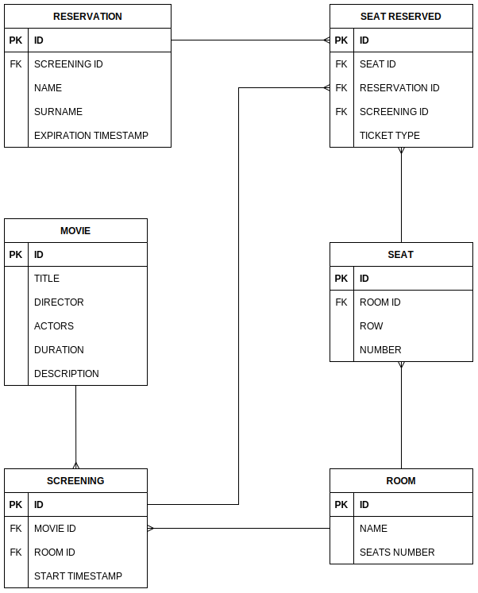

# Ticket Booking App
### Seat reservation system for a multiplex

#### TechStack:

- SpringBoot with Kotlin
- JPA + Hibernate
- Postgres DB
- Python and Shell (Windows/Linux) for scripting

#### Data Model - simplified



#### My assumptions:

- When user selects the day and time when he/she would like to see the movie, the system lists movies available on that day at specified time and after (until the midnight of that day)
- The specified date must be from range [-15 minutes, +1 year]; let say that cinema does not schedule their screenings that far ahead in the future and does not want to show screenings that already started (~15 minutes for ads)
- Seat reservation system does not allow paying for reserved tickets which can be bought only before reservation expiration timestamp (probably in box office)
- Reservation expiration timestamp is defined as time of given movie screening minus 15 minutes - that way we can make sure that people with reservations that don't show up and pay, will not make our cinema go bankrupt
- If you do not pay for reserved tickets in the box office at least 15 minutes before the screening, the reservation expires
- There cannot be a single place left over in a row between two already reserved places - after reservation is made, there cannot be any lone seat left between two reserved seats; at the same time there can be a lone seat at the end of a row (the task does not mention anything about that)
- Ticket Type (Seat Reserved attribute) is just information for a cinema how many tickets of given type have been reserved (and possibly sold) for a specific movie screening; just like in real life while making ticket reservation there is no need and possibility to choose a specific ticket type for a specific seat if more than one seat is to be reserved; that's why I don't care about assigning a specific ticket type to a specific seat

#### How to run?

- You should have Java SDK 17 and Gradle installed on your machine
- My Springboot project was initialized with following settings:

    - Gradle Project
    - Language: Kotlin
    - Springboot: 2.6.6
    - Packaging: Jar
    - Java: 17
- If you are using Ubuntu - run the setUpDB.sh script which will automatically install Postgres and create database for you (if script does not run - check your bash interpreter location and modify script accordingly); agree to all prompts if they show up (they should not)
- If you are using Windows:
  - Install Postgres manually (sorry)
  - Open psql shell, log in, check connection with DB and create new database by typing in commands:
```shell
\conninfo
```
- If everything went right, the output displays information on the database name, the account you are logged in, the socket path, and port number.

Continue work in psql shell

- Create DB "booking":
```shell
CREATE DATABASE booking;
```
- To list databases:
```shell
\l 
```
- To connect to DB:
```shell
\c booking
```

You should now be logged in as "booking":
```shell
booking-#
```

You can now leave psql - everything works fine.

### IMPORTANT INFO FOR WINDOWS AND UBUNTU
##### Remember to check application.properties file (booking\src\main\resources) to check if settings related to DB are configured properly for you (especially check DB password setting)

- After creating database, you can execute now the runApp.bat or runApp.sh script (depending on your OS)
- Application should build and run (building and running done by gradlew)
- After application start, the application will start new process and execute script: initDB.sh or initDB.bat (depending on your OS)
- The shell script will assume that you have python installed on your machine and will only download necessary dependencies ('requests') with 'pip' 
- Then it will run python script that will populate your 'booking' database with default data

## TESTING
